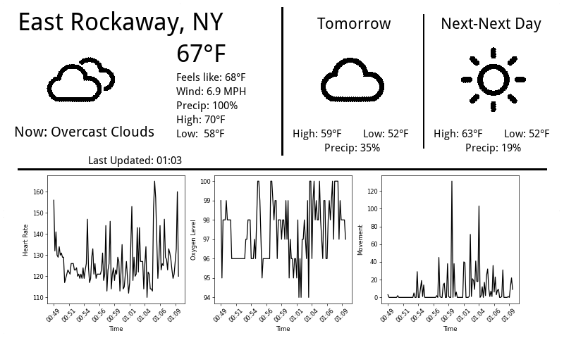

# WeatherDisplay

E-ink weather display for Raspberry Pi Zero W + Waveshare 7.5" V2 (800×480).

Shows current conditions, 8-hour hourly forecast, and 7-day weekly forecast for Wantagh, NY. Refreshes only when the weather actually changes. Powered by the [Open-Meteo](https://open-meteo.com/) API — no API key required.



---

## Hardware

- Raspberry Pi Zero W
- [Waveshare 7.5" e-Paper HAT V2](https://www.waveshare.com/wiki/7.5inch_e-Paper_HAT) (800×480, black & white)

---

## Setup

### 1. Clone the repo

```bash
git clone <repo-url>
cd TideTracker
```

### 2. Install dependencies

```bash
pip3 install -r requirements.txt
```

### 3. Enable SPI on the Pi

```bash
sudo raspi-config
# Interface Options → SPI → Enable
```

### 4. Run manually (for testing)

```bash
python3 weather_display.py
```

On a machine without the e-ink display attached, the rendered image is saved to `images/screen_output.png` instead of writing to the display.

---

## Auto-start on boot (systemd)

Install the service so the display starts automatically whenever the Pi boots:

```bash
sudo cp weather.service /etc/systemd/system/
sudo systemctl enable weather.service
sudo systemctl start weather.service
```

Check status:

```bash
sudo systemctl status weather.service
```

View logs:

```bash
journalctl -u weather.service -f
```

---

## Configuration

Edit `config.py` to change location:

```python
LOCATION = 'Wantagh, NY'
LATITUDE = 40.6734
LONGITUDE = -73.5132
```

No API key needed — Open-Meteo is free and unauthenticated.

---

## How it works

- Polls Open-Meteo every 30 minutes and refreshes the display on every poll
- Logs whether the data changed or not (useful for debugging)
- On API failure: keeps the current display, retries in 5 minutes
- On startup: always clears the screen and renders immediately
